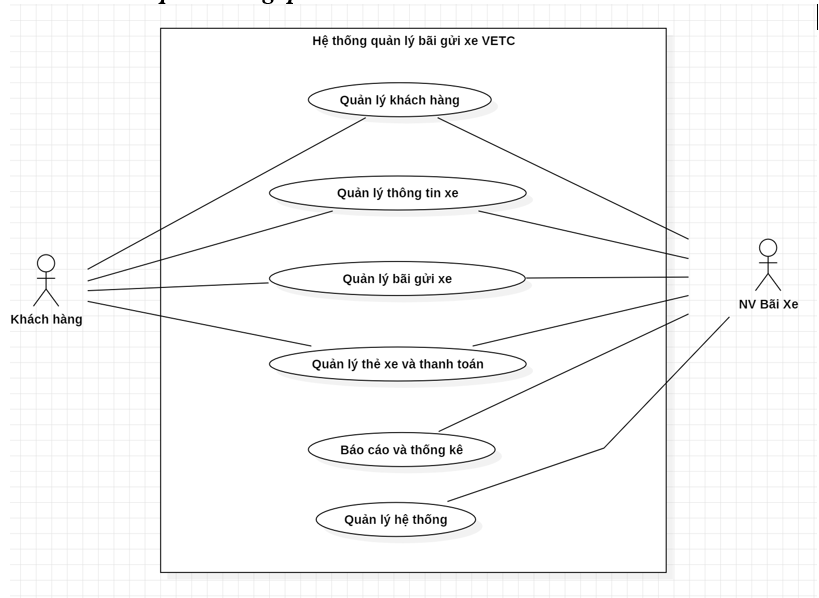
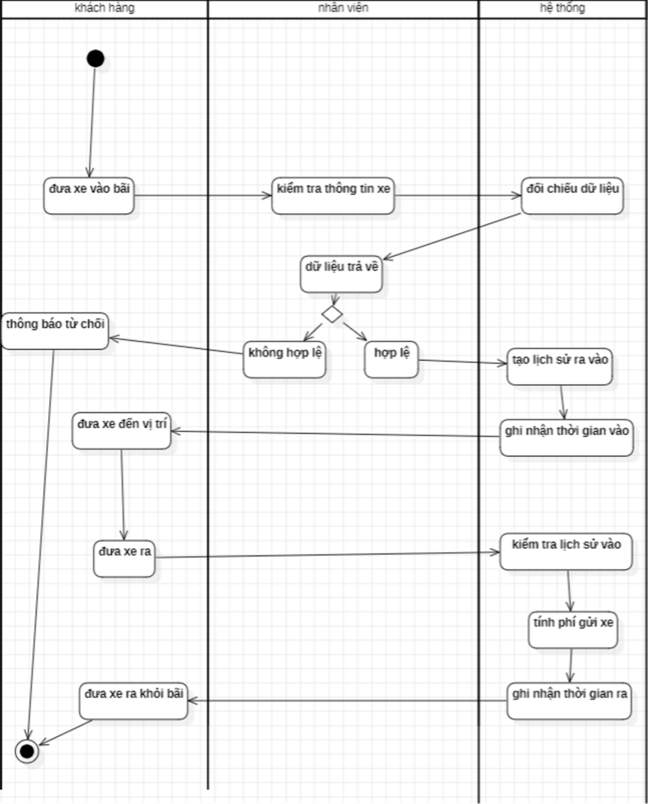
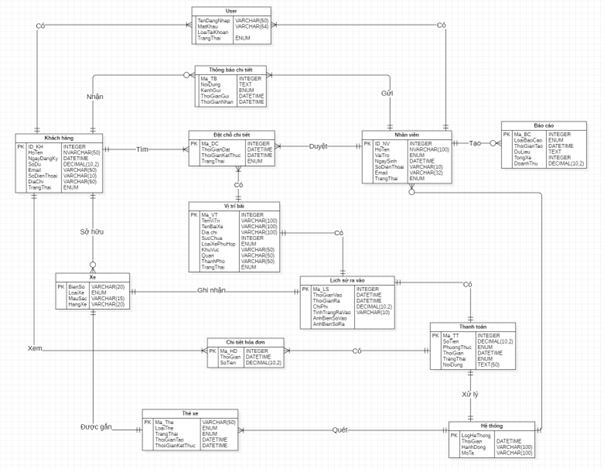

# Parking Management System (VETC)

## Overview
A parking management system designed to optimize vehicle entry/exit, reservation, and payment processes using modern technologies such as VETC and electronic payment.

## My Role
Business Analyst

## Responsibilities
- Gathered and analyzed business requirements for parking operations
- Designed system workflows using BPMN and Activity Diagrams
- Created UML diagrams (Use Case, Activity)
- Designed database structure (ERD, relational schema)
- Defined user roles: Customer, Staff, Manager

## Key Features
- Vehicle entry/exit tracking
- Parking slot management
- Reservation system
- Payment processing (VETC, cashless)
- Reporting and analytics

## Deliverables
- Software Requirement Specification (SRS)
- UML Diagrams (Use Case, Activity)
- ERD & Database Design
- UI Mockups

## Tools & Technologies
- Draw.io
- StarUML
- SQL Server
- Figma

## Diagrams

### Use Case

### Activity Diagram

### ERD

